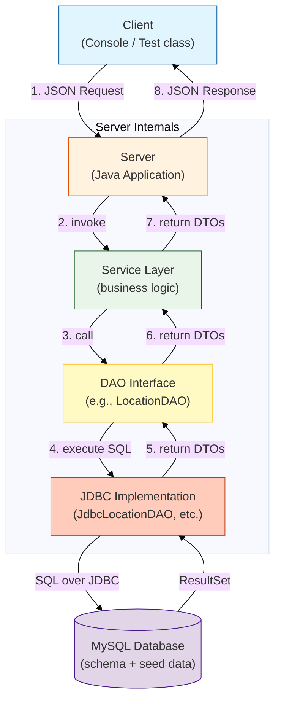

# 2025-26 - OOP - L8 - GCA2 — N-tier System

## 1. Project Overview

### Domain summary (150–200 words)
> Ireland Tour & Trail Planning System
> The purpose of this system is to manage and organise walking tours and travel routes across Ireland.
> The application will allow users to view, create, update and delete tours and related information.
> System will store information about different trails, locations and tour stops. Each trail will include details such as names, county and distance in kilometres, estimated duration and difficulty level.
> Locations will store information about natural or cultural places such as forests, lakes, mountains and historical sites. Tour stops will connect locations to specific trails in a defined order.
> The system will also support storing media files such as images of trails using binary data (BLOB) with metadata including file name, content type and file size.
> This project demonstrates object-oriented design, DAO pattern, JDBC database connectivity and client-server communication using JSON.
> It also allows us to implement filtering, search features and binary file handling.

### Team
- **Group ID:** `2025-26-L8-OOP-GCA2-Group1`
- **Members:**
  - Student A — `D00270617`
  - Student B — `D00283071`

 ### Key features
- JDBC DAO layer with full CRUD (Stage 1 foundation)
- Client–server (sockets) JSON protocol + `ServerResponse<T>` wrapper
- Multithreaded server using `ExecutorService`
- Binary file upload + retrieval stored as DB BLOB with metadata
- JUnit 5 test suite with ≥70% line coverage evidence at final stage

## 2. How to Run

### Prerequisites
- Java: `17+`
- IntelliJ IDEA (recommended)
- MySQL Server (local)
- Maven

### 2.1 Database setup
1. Import file called 'setup.sql' into phpmyadmin
2. Verify it's connected by running DbSmokeTest

# Architecture Diagram

